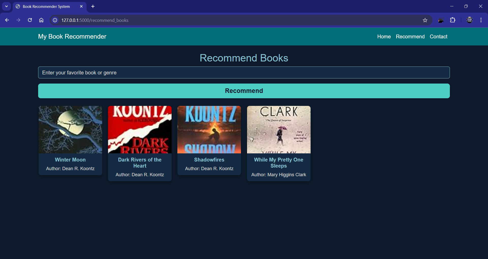

# Collaborative Filtering-Based Book Recommendation System

📚 **Project Overview**  
This project implements a **Book Recommendation System** using a combination of:  
- **Popularity-Based Recommendations** for suggesting the top 50 books based on aggregated ratings.  
- **Collaborative Filtering** for personalized book recommendations tailored to individual users.  

The system processes datasets containing books, users, and ratings to deliver meaningful recommendations. It is built with Python, employs ``cosine similarity`` for collaborative filtering, and is deployed as a web application using Flask.

---

## 💡 **Features**
- **Popularity-Based Recommendations**: Ranks books based on average rating and number of ratings to showcase the top 50 highly-rated books.  
- **Personalized Recommendations**: Uses collaborative filtering to recommend books based on user preferences and similar users.  
- **Efficient Data Processing**: Filters out invalid or sparse data to improve recommendation quality.  
- **Flask Web Application**: Provides a user-friendly interface for browsing and receiving recommendations.  

---

## 🔍 **Collaborative Filtering Explained**  
Collaborative filtering is a machine learning technique used for making recommendations by finding similarities between users or items. In this project, we use **item-based collaborative filtering**, which focuses on identifying books similar to a given book based on user ratings.

### **Steps**
1. **Matrix Creation**: A pivot table (`pt`) is created where rows represent books, columns represent users, and values are ratings.  
2. **Similarity Computation**: Cosine similarity is calculated between books to identify similar items.  
3. **Recommendation Generation**: For a given book, top similar books are ranked and suggested to the user.

---

## 📂 **Datasets**
The system utilizes three datasets:

1. **Books Dataset (`Books.csv`)**:  
   Contains book information, including title, author, year, publisher, and cover image URLs.  
   - Example Columns: `ISBN`, `Book-Title`, `Book-Author`, `Year-Of-Publication`, `Publisher`  

2. **Ratings Dataset (`Ratings.csv`)**:  
   Holds user ratings for books.  
   - Example Columns: `User-ID`, `ISBN`, `Book-Rating`  

3. **Users Dataset (`Users.csv`)**:  
   Stores demographic details of users.  
   - Example Columns: `User-ID`, `Location`, `Age`  

---

## 🚀 **Methodology**

### **1. Popularity-Based Recommendation System**
**Goal**: Recommend the top 50 books based on ratings and popularity.  

**Steps**:  
- Aggregate the number of ratings and average ratings for each book.  
- Filter books with a significant number of ratings (e.g., >250 ratings).  
- Rank and display the top 50 books with their titles, authors, ratings, and cover images.  

---

### **2. Collaborative Filtering-Based System**
**Goal**: Generate personalized book recommendations.  

**Steps**:  
1. **User Filtering**: Select users with more than 200 ratings to ensure meaningful interactions.  
2. **Book Filtering**: Retain books rated by at least 50 users for quality recommendations.  
3. **Pivot Table**: Create a user-book rating matrix (`pt`).  
4. **Similarity Calculation**: Compute cosine similarity between books.  
5. **Recommendation**: Find and display the most similar books for a selected book.  

---

### **3. Deployment**
- The system is deployed as a Flask web app.  
- Recommendations are generated dynamically and displayed with book images, authors, and ratings.  

---

## 🔧 **Technologies Used**

**Programming Languages**
- Python  

**Libraries**
- **pandas**: Data manipulation  
- **numpy**: Numerical computations  
- **scikit-learn**: Cosine similarity  

**Web Framework**
- **Flask**  

**Data Visualization**
- **Bootstrap**: For UI design  
**Serialization**
- **Pickle**: For efficient deployment of models and data





## 🖥️ How to Use

1. Clone the repository:

   ```bash
   git clone <repository-url>
   ```

2. Navigate to the project directory:

   ```bash
   cd book-recommender
   ```

3. Install dependencies:

   ```bash
   pip install -r requirements.txt
   ```

4. Run the Flask application:

   ```bash
   python app.py
   ```

5. Open your browser and go to `http://127.0.0.1:5000`.
